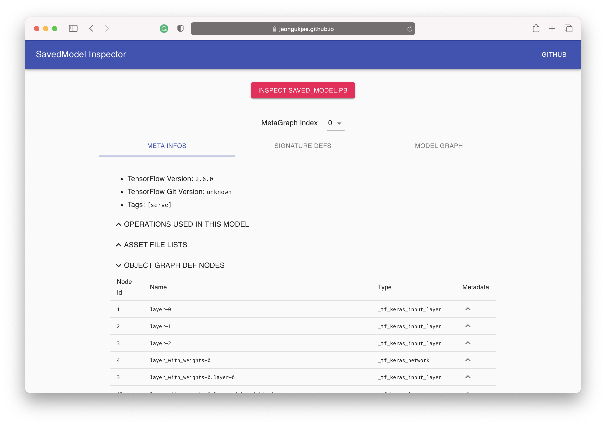

# SavedModel Inspector

Inspect TensorFlow SavedModel protos on Web.

## How to use

Just click `Inspect saved_model.pb` button and select a file that you want to inspect.

## TODO

- [ ] Visualize Model Graph
